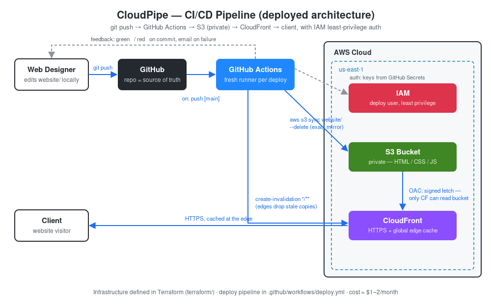

# CloudPipe — CI/CD Pipeline for Static Website Deployment


Push to `main` → GitHub Actions syncs `website/` to S3 → CloudFront cache invalidated → live site updated in ~1 minute. No manual uploads, no forgotten files.

## Architecture



The problem this solves: developers were manually uploading files to production (15–20 min per change, occasional missing files breaking the live site). Now deployment is automatic, consistent, and visible.

## Setup (one time, ~15 minutes)

### 1. Deploy the infrastructure (Terraform)

```bash
cd terraform
terraform init      # one-time: downloads the AWS provider plugin
terraform plan      # review the diff: 8 to add, 0 to change, 0 to destroy
terraform apply     # creates bucket, CloudFront, IAM user (~5-10 min)
```

Get the outputs (you'll need them in step 3):

```bash
terraform output
```

> An equivalent CloudFormation template lives in `infrastructure/template.yaml`. Deploy **one or the other**, never both — they define the same resources and would collide on the bucket name. This project runs on the Terraform version.

### 2. Create access keys for the deploy user

```bash
aws iam create-access-key --user-name cloudpipe-github-actions
```

Copy the `AccessKeyId` and `SecretAccessKey` — the secret is shown only once.

### 3. Add GitHub repository secrets

In the repo: Settings → Secrets and variables → Actions → New repository secret

| Secret | Value |
|---|---|
| `AWS_ACCESS_KEY_ID` | from step 2 |
| `AWS_SECRET_ACCESS_KEY` | from step 2 |
| `S3_BUCKET` | Terraform output `bucket_name` |
| `CLOUDFRONT_DISTRIBUTION_ID` | Terraform output `distribution_id` |

### 4. Push and verify

```bash
git add . && git commit -m "Initial deploy" && git push origin main
```

Watch the run in the **Actions** tab, then open the `website_url` from `terraform output`.

Gotchas hit during the real setup (kept here so future-you remembers):

- Pushing `.github/workflows/` files requires a git credential with the `workflow` scope. Fix: `gh auth login` (or a classic PAT with `repo` + `workflow`), then push again.
- The workflow's `paths:` filter means a push that touches only docs/terraform won't deploy. First-time or manual deploys: Actions tab → Deploy Website → **Run workflow** (`workflow_dispatch`).

## Deployment process (day to day)

1. Edit files in `website/`
2. Commit and push to `main` (or merge a PR)
3. Done. The Actions tab shows success/failure; GitHub emails you if it fails.

Manual deploy/redeploy: Actions tab → Deploy Website → Run workflow.

Rollback: `git revert <bad-commit> && git push` — the pipeline redeploys the previous version.

## Troubleshooting

| Symptom | Likely cause | Fix |
|---|---|---|
| Workflow fails at "Configure AWS credentials" | Wrong/missing secrets | Re-check the 4 repo secrets |
| Fails at "Sync files to S3" with AccessDenied | Bucket name secret wrong, or IAM policy changed | Verify `S3_BUCKET` matches the stack output |
| Deploy succeeds but site shows old content | Invalidation step skipped/failed | Re-run workflow; check invalidation step logs |
| 403/404 on the site | Missing `index.html` in `website/` | Confirm the file exists and the sync step ran |
| Deploy succeeds but site broken | Bug in the code itself | Pipeline ships what you push — revert the commit |

Deployment logs live in the GitHub **Actions** tab — every run, every step, kept with the commit that triggered it.

## Security notes & known limitations

- The S3 bucket is **private**; only CloudFront can read it (Origin Access Control).
- The IAM user is **least-privilege**: it can only sync this bucket and invalidate this distribution.
- Access keys are created via CLI, **not** in Terraform — an `aws_iam_access_key` resource would store the secret in the state file in plaintext.
- `terraform.tfstate` is gitignored and must never be committed; for team use, move state to an S3 backend with locking.
- **Production upgrade path:** replace the long-lived access keys with [GitHub OIDC federation](https://docs.github.com/en/actions/deployment/security-hardening-your-deployments/configuring-openid-connect-in-amazon-web-services) (short-lived credentials, nothing to rotate or leak).
- No staging environment or automated tests yet — reasonable next steps as the team grows.
- `/*` cache invalidation is simple but coarse; fine at this scale (first 1,000 paths/month are free).

## Cost

Roughly **$1–2/month** for a small-business site: S3 pennies, CloudFront free tier covers typical traffic, GitHub Actions free tier covers deploys, CloudFormation free.

## Project structure

```
cloudpipe-deploy/
├── website/                  # the actual site — edit here
│   ├── index.html
│   ├── css/style.css
│   └── js/main.js
├── .github/workflows/
│   └── deploy.yml            # the CI/CD pipeline
├── terraform/                # infrastructure as code (deployed version)
│   ├── versions.tf           # terraform + provider version pins
│   ├── variables.tf
│   ├── main.tf               # S3, OAC, CloudFront, IAM
│   └── outputs.tf            # values that feed the GitHub secrets
├── infrastructure/
│   └── template.yaml         # equivalent CloudFormation (reference)
└── README.md
```
